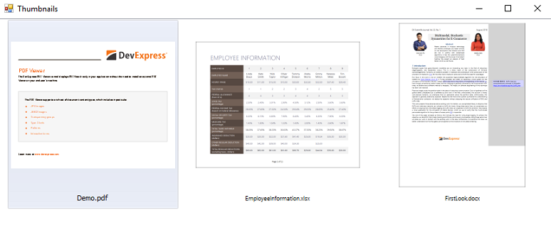

<!-- default badges list -->

<!-- default badges end -->

# Office File API - Create Thumbnail Images for Excel, Word and PDF Documents

This example demonstrates how to generate preview images for files in different document formats (DOCX, XLSX, PDF) using the [Office File API](https://docs.devexpress.com/OfficeFileAPI/14911/Office-File-API) library. To display the generated images the WinForms GridControl's [WinExplorerView](https://docs.devexpress.com/WindowsForms/114759/Controls-and-Libraries/Data-Grid/Views/WinExplorer-View) is used.

## Files to Review

* [Form1.cs](./CS/Form1.cs) (VB: [Form1.vb](./VB/Form1.vb))
* [ImageExporterHelper.cs](./CS/ImageExporterHelper.cs) (VB: [ImageExporterHelper.vb](./VB/ImageExporterHelper.vb))

## Documentation

* [How to: Generate a Thumbnail Image from a Worksheet](https://docs.devexpress.com/OfficeFileAPI/403376/spreadsheet-document-api/examples/worksheets/how-to-generate-a-thumbnail-from-a-worksheet)
* [How to: Generate a Thumbnail Image from a Chart Sheet](https://docs.devexpress.com/OfficeFileAPI/403379/spreadsheet-document-api/examples/charts/how-to-generate-a-thumbnail-from-a-chart-sheet)
